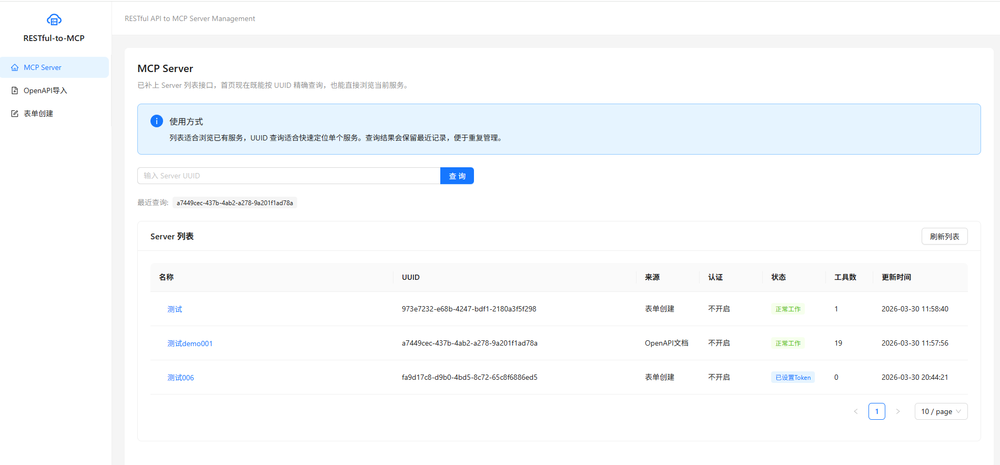
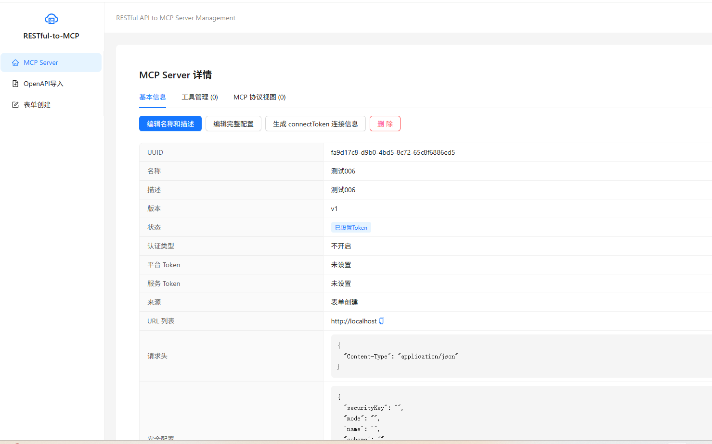
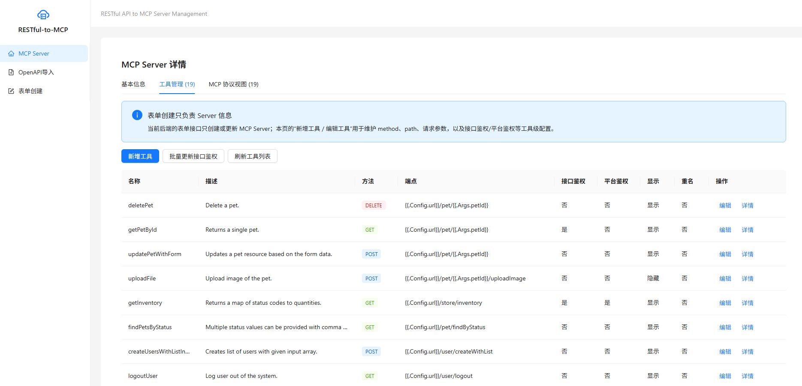
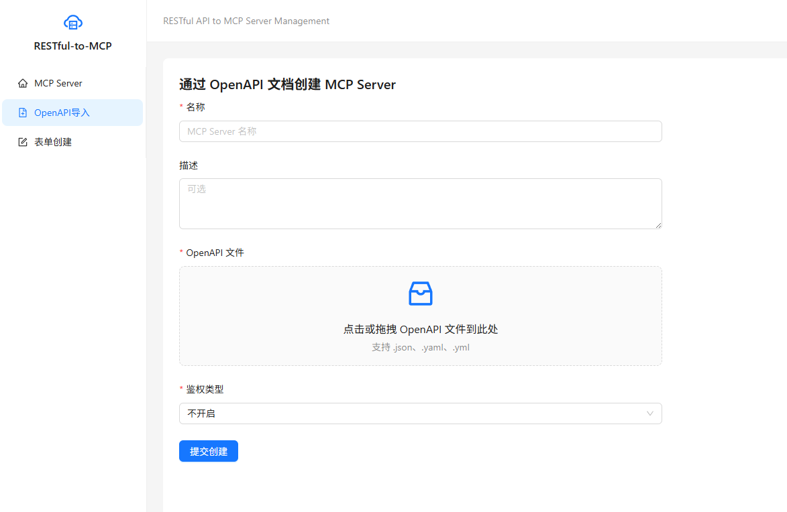
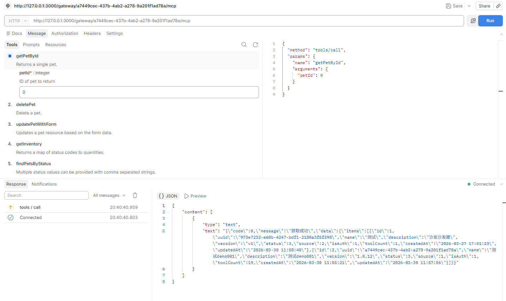

# RESTful-to-MCP

[English](./README.md) | [中文](./README.zh-CN.md)

Turn existing RESTful APIs into [MCP (Model Context Protocol)](https://modelcontextprotocol.io/) servers so AI clients can call your APIs through a standard MCP gateway.

## Features

- Import Swagger 2.0 / OpenAPI 3.x documents and generate MCP servers and tools automatically.
- Create MCP servers and tools manually from the management UI.
- Expose a unified MCP gateway at `/gateway/:serverToken/mcp`.
- Support tool testing, authentication settings, and server detail inspection in the frontend.
- Support PostgreSQL / MySQL and Redis.
- Optional Nacos service registration.

## Screenshots

### Server List



### Server Detail



### Tool Detail



### OpenAPI Import



### API Test Example



## Architecture

```text
RESTful API / OpenAPI
        |
        v
RESTful-to-MCP Management API (/v1/...)
        |
        +--> OpenAPI parser / manual form configuration
        |
        +--> MCP server + tool registry
        |
        v
MCP Gateway (/gateway/:serverToken/mcp)
        |
        v
MCP clients (Claude Desktop, Cursor, Cherry Studio, etc.)
```

## Quick Start

### Requirements

- Go 1.24+
- PostgreSQL 14+ or MySQL 8+
- Redis 7+

### Run Locally

```bash
git clone https://github.com/lengyue1084/restful-to-mcp.git
cd restful-to-mcp

cp configs/config.yaml.example configs/config.yaml
# edit configs/config.yaml

go install github.com/google/wire/cmd/wire@latest
make wire
make run
```

Default backend address:

```text
http://localhost:9002
```

### Frontend

The repository also contains a React + Vite frontend in [`web/`](./web).

```bash
cd web
npm install
npm run dev
```

Default frontend address:

```text
http://localhost:3000
```

## MCP Usage

The gateway endpoint is:

```text
POST /gateway/:serverToken/mcp
```

`serverToken` now supports both:

- server UUID
- generated `connectToken`

Important:

- Do not open the MCP endpoint directly in a browser.
- The MCP gateway expects `POST` JSON-RPC requests.
- A browser `GET` request will usually return `404`.

Example `tools/list` request:

```bash
curl -X POST "http://localhost:9002/gateway/{serverToken}/mcp" \
  -H "Content-Type: application/json" \
  -H "Accept: application/json, text/event-stream" \
  -d '{"jsonrpc":"2.0","id":1,"method":"tools/list","params":{}}'
```

## Main APIs

| Endpoint | Description |
| --- | --- |
| `POST /v1/openapi/upload` | Import an OpenAPI document |
| `POST /v1/openapi/updateForAuth` | Update auth settings |
| `POST /v1/mcpServer/list` | List MCP servers |
| `POST /v1/mcpServer/createByForm` | Create a server manually |
| `POST /v1/mcpServer/updateMcpServerByForm` | Update a manually created server |
| `POST /v1/mcpServer/getMcpServerInfoByUUID` | Get server detail |
| `POST /v1/mcpServer/getMcpConnectTokenByUUID` | Generate a connect token |
| `POST /v1/mcpServer/getMcpServerToolsByUUID` | List tools under a server |
| `POST /v1/mcpServer/createMcpServerTool` | Create a tool |
| `POST /v1/mcpServer/updateMcpServerTool` | Update a tool |
| `POST /v1/mcpServer/testMcpServerTool` | Test a tool request |
| `POST /gateway/:serverToken/mcp` | MCP gateway |

## Project Structure

```text
api/                  HTTP API layer
cmd/                  application entry + wire
configs/              configuration files
docs/                 documents and screenshots
internal/             business logic, data, MCP runtime
middleware/           middleware
pkg/                  shared utilities
router/               route registration
web/                  frontend management UI
```

## License

[MIT](./LICENSE)
